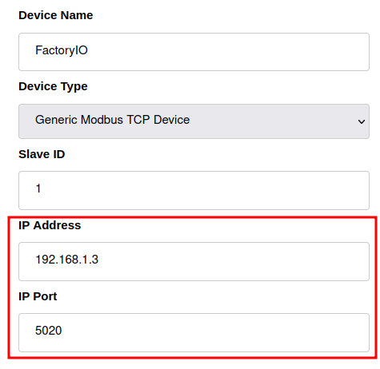

# Capstone Project
This code is for my Computing Security Masters Capstone Project of Spring 2023 at Rochester Institute of Technology. The program performs a MITM attack against [Ignition](https://inductiveautomation.com/) by Inductive Automation, and a PLC over Modbus/TCP.

# How to configure your environment
The test environment used was 2 Windows 10 PCs, a Linux machine, and a Cisco 3550 Multi-Layer Switch.

## Dependencies
### Packages
- `iptables` (v1.8.9 used in testing)
- `libnetfilter_queue` (v1.0.5-1 used in testing from [Arch Linux Repository](https://archlinux.org/packages/extra/x86_64/libnetfilter_queue/))
- `Python3` (v3.10.10 used in the testing)
- `pip`. (v23.0 used in testing)
- Please see the [requirements.txt](./requirements.txt), and run `pip install -r requirements.txt` 

### Required Software
- [Ignition](https://inductiveautomation.com/) by Inductive Automation (v8.1.26 used in testing)
- Ignition Designer, comes packaged with Ignition and can be downloaded after installation.
- [OpenPLC WindowsRuntime](https://openplcproject.com/) by OpenPLC Project 
- [FactoryIO Ultimate](https://factoryio.com/) by Real Games (v2.5.4 used in testing)

## Windows Machine 1: Simulated PLC
These are instructions for installing FactoryIO and OpenPLC on the same machine. **Note:** The slave device settings in OpenPLC must match the ModbusTCP server settings in FactoryIO
### OpenPLC Runtime installation and Configuration
1. Download and install [OpenPLC WindowsRuntime](https://openplcproject.com/)
	- The default settings should work just fine
2. Once OpenPLC runtime is installed navigate to `localhost:8080`
3. Click on `Programs>Browse...` and select the [openplc.st](./openplc_solutions/openplc.st) file within this repository. Then click `Upload Program`.
	- If you have OpenPLC Editor you can build the [Assembler](./openplc_solutions/assembler) project and generate the `.st` file yourself.
4. Upon successful upload, navigate to the `Slave Devices` tab and click `Add New Device`. Mimic the settings in the image below, be sure to change the IP address to the one on the windows machine, and port the port to 5020
	- Since FactoryIO and OpenPLC are living on the same machinewe need to choose a different port than 502 (mbap) for them to communicate on to avoid conflicts.
	
5. Once the networking settings are added we need to add the registers.

|  Address Type  | Start | Size |
|------------------------|---------|---------|
| Discrete Inputs (%IX100.0) | 0 | 16 |
| Coils (%QX100.0) | 0 | 12 |
| Input Registers (%IW100) | 0 | 0 |
| Holding Registers - Read (%IW100) | 0 | 0 |
| Holding Registers - Write (%QW100) | 0 | 1 |
This Values are obtained from the Modbus/TCP Server Configuration settings in the FactoryIO Assmbler program. 

### FactoryIO Installation and Configuration
1. Download and install [FactoryIO Ultimate](https://factoryio.com/)
	- The default settings should do

## Windows Machine 2: Ignition Gateway Server