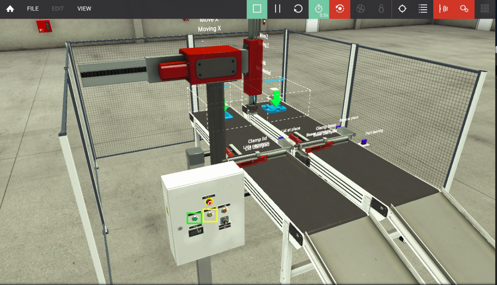
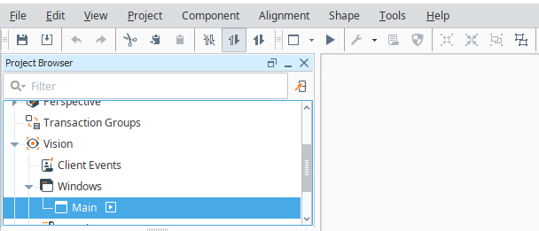

# Capstone Project
This code is for my Computing Security Masters Capstone Project of Spring 2023 at Rochester Institute of Technology. The program performs a MITM attack against [Ignition](https://inductiveautomation.com/) by Inductive Automation, and a PLC over Modbus/TCP.

[Jump to Exploit usage](#Running the Exploit)

# How to configure your environment
The test environment used was 2 Windows 10 PCs, a Linux machine, and a Cisco 3550 Multi-Layer Switch.

## Dependencies
### Packages
- `iptables` (v1.8.9 used in testing)
- `libnetfilter_queue` (v1.0.5-1 used in testing from [Arch Linux Repository](https://archlinux.org/packages/extra/x86_64/libnetfilter_queue/))
- `Python3` (v3.10.10 used in the testing)
- `pip`. (v23.0 used in testing)
- Please see the [requirements.txt](./requirements.txt), and run `pip install -r requirements.txt` 

### Required Software
- [Ignition](https://inductiveautomation.com/) by Inductive Automation (v8.1.26 used in testing)
- Ignition Designer, comes packaged with Ignition and can be downloaded after installation.
- [OpenPLC WindowsRuntime](https://openplcproject.com/) by OpenPLC Project 
- [FactoryIO Ultimate](https://factoryio.com/) by Real Games (v2.5.4 used in testing)

## Windows Machine 1: Simulated PLC and Production Line
These are instructions for installing FactoryIO and OpenPLC on the same machine. **Note:** The slave device settings in OpenPLC must match the ModbusTCP server settings in FactoryIO. This computer acts as a simulated production line with sensors and a PLC.
### OpenPLC Runtime installation and Configuration
1. Download and install [OpenPLC WindowsRuntime](https://openplcproject.com/), and start the runtime be hitting the Windows Key and searching for `OpenPLC Runtime`.
	- The default settings should work just fine
2. Once OpenPLC runtime is installed navigate to `localhost:8080`
3. Click on `Programs>Browse...` and select the [openplc.st](./openplc_solutions/openplc.st) file within this repository. Then click `Upload Program`.
	- If you have OpenPLC Editor you can build the [Assembler](./openplc_solutions/assembler) project and generate the `.st` file yourself.
4. Upon successful upload, navigate to the `Slave Devices` tab and click `Add New Device`. Mimic the settings in the image below, be sure to change the IP address to the one on the windows machine, and port the port to 5020
	- Since FactoryIO and OpenPLC are living on the same machine we need to choose a different port than 502 (mbap) for them to communicate on to avoid conflicts.
	
5. Once the networking settings are added we need to add the registers. The values are obtained from the Modbus/TCP Server Configuration from the Assember program in FactoryIO.

	|  Address Type  | Start | Size |
	|------------------------|---------|---------|
	| Discrete Inputs (%IX100.0) | 0 | 16 |
	| Coils (%QX100.0) | 0 | 12 |
	| Input Registers (%IW100) | 0 | 0 |
	| Holding Registers - Read (%IW100) | 0 | 0 |
	| Holding Registers - Write (%QW100) | 0 | 1 |
	
6. Hit `Save`, navigate to the dashboard, and click `Start PLC`
	- Note: It will have connection failure logs until FactoryIO is up

### FactoryIO Installation and Configuration
1. Download and install [FactoryIO Ultimate](https://factoryio.com/), and start the progam.
	- The default settings should do.
	- the default credentials are `openplc` for the username and password.
2. Copy the [Assembler.factoryio](./factoryio_solutions/Assembler.factoryio) file in this repository to the `C:\Users\<you>\Documents\Factory IO\My Scenes\` folder.
3. In FactoryIO select `Scenes>My Scenes>Assembler`
4. In the opened project, select `File>Drivers` and then `Modbus TCP/IP Server` from the drop down.
5. Click `Configuration` in the top right and be sure to **update the port to 5020**. Also double check that you are on the right network interface and the IP address, port, and register settings are line up with what was entered into the OpenPLC slave device settings. If they are different please update the OpenPLC slave devices to be the same with what exists in FactoryIO
 6. Close out of the Modbus TCP/IP Server ocnfiguration settings, and navigate back to the machine view.
 7. Click the reset button (yellow rectangle on control panel in image below) until clamps and pick-and-place machine are reset. Once everything is reset hit the start button (green rectangle on control panel in image below) and watch the machine run. 
 
 	
 
 8. To reset the simulation click the reset button on the panel, and the reset button in the top right of the FactoryIO toolbar.

## Windows Machine 2: Ignition Gateway Server
This computer acts as the Ignition Gateway server. It will have an instance of Ignition Gateway running on it and a Vision Client we can use to interact with Windows Machine 1. It should be noted that Vision Clients can be run on separate computers that do not have Ignition Gateway running on them. However, all devices (Vision Clients, PLCs, etc) connected to the Ignition Gateway all talk to each other through the Gateway. For example you have your Ignition Gateway server living in a Server closet with a PLC configured, and a computer with a Vision Client on the production floor at a machine. The Vision Client will talk through the remote Ignition Gateway to communicate with the PLC. Never Vision Client to PLC. 

### Ignition Installation and Configuration
1. Download and Install [Ignition](https://inductiveautomation.com/).
	- The defaults should do
2. At the end of the installation select `Standard Edition`.
3. Navigate to `localhost:8088` and login with your credentials.
4. Select `Status` and the lefthand tool bar, and then click `Devices`
5. Click `Add Device`
	- If that option is not present, click `Configuration` in the top right corner.
6. Mimic the settings from the image below, being sure to change the IP address to the one of WIndows Machine 1. Then click `Save`
	
7. Once the device is created, click the `More` dropdown and select `Addresses`
8. Click on `Browse...` and select the [modbus_config.csv](./ignition_solutions/modbus-config.csv) within this repository. 
9. Import this file and click `Save` at the bottom.
	

### Ignition Designer Installation and configuration
1. Once Ignition is installed, click `Home` on the lefthand tool bar, and then `Download Designer Launcher` and install it
	- The defaults should do. 
2. Click `Add Designer` and select the Ignition Gateway with the `localhost:8088` address. 
3. Click the newly added Designer, and then click `Open Designer`
4. Login with your credentials you configured in installation of Ignition
5. Click `Import Project` at the top right, and select [test_2023-03-06_1025_2023-03-25_1532.zip](ignition_solutions/test_2023-03-06_1025_2023-03-25_1532.zip) from within this repository. No need to modify the fields. 
6. Open the project.
7. In the `Tag Browser` on the lefthand panel click the 3 dots, then `Import Tags>Interactive`. Select the [tags.json](./ignition_solutions/tags.json) file within this repository and import all tags.

	

8. Once the tags are imported expand the `Vision` drop down on the left, then expand the `Windows` dropdown within. Double Click the `Main` window. 
9. On the top toolbar select Read/Write access to Gateway (double filled arrows boxed in picture below) and then the play button (boxed in image below) to go into preview mode. You can also hit F10 or F11 to launch the project in windowed mode or full screen mode respectively. I suggest using windowed mode.

	
	
#Running the Exploit
